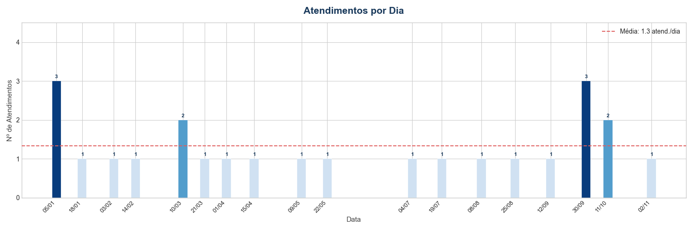
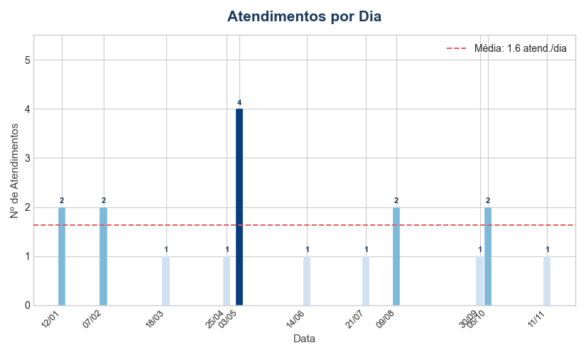
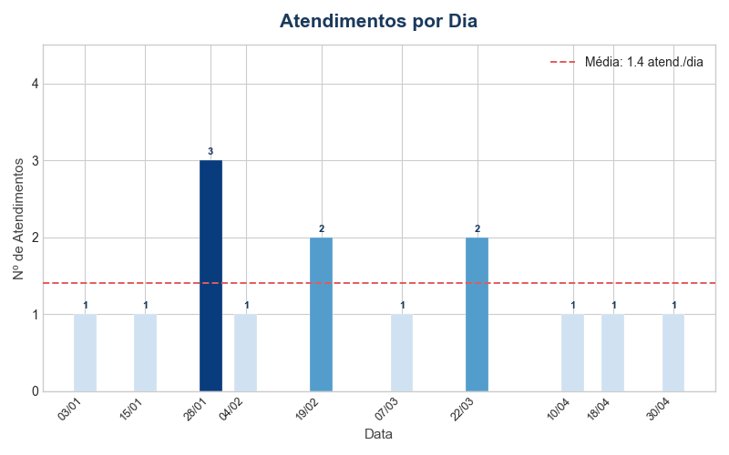

# Repostas Case EDS

## Problema 1
```sql
-- Cria tabela PACIENTE no schema stg_prontuario
-- Em vez de utilizarmos um id autoincremental, seria possível criar uma PK composta por id + hospital de origem, para manter os ids originais
CREATE TABLE stg_prontuario.PACIENTE (
	id SERIAL PRIMARY KEY, -- Considerei que novos ids serão gerados
	nome VARCHAR(100) NOT NULL,
	dt_nascimento DATE NOT NULL,
	cpf INT NOT NULL, -- Seria melhor utilizar VARCHAR, para não ignorar o zero como primeiro dígito
	nome_mae VARCHAR(100), -- admite null, já que essa informação pode ser desconhecida
	dt_atualizacao TIMESTAMP DEFAULT CURRENT_TIMESTAMP -- timestamp atual inserido a cada atualização
)
```

## Problema 2
```sql
-- Insere em stg_prontuario.PACIENTE a união das tabelas PACIENTE de todos os outros hospitais
-- Não traz 'id' das outras tabelas PACIENTE, já que em stg_prontuario.PACIENTE essa coluna foi definida de forma autoincremental...
-- isso evita problemas com duplicidade de ids, já que é provável que existam pacientes duplicados entre os hospitais
-- Utiliza UNION ALL para não ocultar duplicatas
INSERT INTO stg_prontuario.PACIENTE (nome, dt_nascimento, cpf, nome_mae, dt_atualizacao)
SELECT nome, dt_nascimento, cpf, nome_mae, dt_atualizacao FROM stg_hospital_a.PACIENTE
UNION ALL
SELECT nome, dt_nascimento, cpf, nome_mae, dt_atualizacao FROM stg_hospital_b.PACIENTE
UNION ALL
SELECT nome, dt_nascimento, cpf, nome_mae, dt_atualizacao FROM stg_hospital_c.PACIENTE
```

## Problema 3
```sql
SELECT cpf, COUNT(*) AS quantidade
FROM stg_prontuario.PACIENTE
GROUP BY cpf
HAVING COUNT(*) > 1 -- Realiza COUNT após o agrupamento, identificando quais CPFs aparecem mais de uma vez
ORDER BY quantidade DESC
```

## Problema 4
```sql
WITH

-- Armazena os CPFs duplicados em uma CTE, com base na consulta do Problema 3
cpfs_duplicados AS (
    SELECT cpf
    FROM stg_prontuario.PACIENTE
    GROUP BY cpf
    HAVING COUNT(cpf) > 1 -- realiza COUNT após o agrupamento, identificando quais CPFs aparecem mais de uma vez
),

-- Armazena um ranking com as datas de atualização mais recentes para cada cpf
pacientes_rankeados AS (
    SELECT 
        p.*,
        ROW_NUMBER() OVER (-- cria ranking entre os CPFs duplicados, utilizando a data de atualização como parâmetro para encontrar os mais recentes
            PARTITION BY p.cpf
            ORDER BY p.dt_atualizacao DESC
        ) AS ranking_mais_recente
    FROM stg_prontuario.PACIENTE p
    INNER JOIN cpfs_duplicados c -- mantém apenas os registros de paciente com CPFs dentre os CPFs duplicados
    ON p.cpf = c.cpf
)

SELECT *
FROM pacientes_rankeados
WHERE ranking_mais_recente = 1;
```

## Problema 5
```python
import pandas as pd
from pathlib import Path
from sqlalchemy import create_engine, types

# Define um mapa de tipos entre os tipos nos layouts e no SQLAlchemy
MAPA_TIPOS = {
    'VARCHAR2': types.String,
    'CHAR': types.String,
    'NUMBER': types.Numeric,
    'DATE': types.Date
}
# Define o caminho absoltuo do sigtap
CAMINHO_SIGTAP = Path('sigtap-simplificado')

# Retorna um dicionário contendo DataFrames com os conteúdos de cada layout
def gera_df_layouts(sigtap_dir: Path = CAMINHO_SIGTAP) -> dict:

    return {
        arquivo.stem.replace('_layout', ''): pd.read_csv(arquivo) # Como o conteúdo do txt de layout está estruturado em csv, lê arquivo dessa forma diretamente
        for arquivo in sigtap_dir.glob('*layout.txt') # Faz isso para cada arquivo de layout
    }

# Retorna um dict contendo DataFrames com os conteúdo de cada tabela ou relacionamento
def gera_df_tabelas(sigtap_dir: Path = CAMINHO_SIGTAP) -> dict:

    # Define dict que armazenará conteúdos das tabelas e relacionamentos
    dict_tb_rl = {}
    # Define dict de layouts, que será necessário para a criação dos DataFrames de tabelas e relacionamentos
    dict_layouts = gera_df_layouts(sigtap_dir)

    # Para cada arquivo de tabela ou relacionamento
    for arquivo in sigtap_dir.glob('*.txt'):
        if arquivo.stem.endswith('_layout'): # Ignora caso seja layout
            continue
        
        # Define variáveis para auxiliar a leitura dos conteúdos em texto
        nome_tb_rl = arquivo.stem
        df_layout = dict_layouts[nome_tb_rl] # Define layout da tabela atual

        # Define as especificações para leitura do conteúdo
        colspecs = list(zip(df_layout['Inicio'] - 1, df_layout['Fim']))

        # Cria DataFrame utilizando read_fwf, que aplica a especificação ao conteúdo do arquivo
        df = pd.read_fwf(
            arquivo,
            colspecs=colspecs,
            names=df_layout['Coluna'].tolist(),
            dtype=str,
            header=None,
            encoding='latin-1'
        )
        # Remove os espaços vazios nas colunas
        df = df.apply(lambda col: col.str.strip())
        dict_tb_rl[nome_tb_rl] = df

    return dict_tb_rl

# Define função que resolve o tipo recebido do layout
def resolve_tipo(tipo_layout: str, tamanho: int) -> types:

    # Extrai tipo do mapa de tipos. Caso não haja correspondência, define Text por padrão
    tipo = MAPA_TIPOS.get(tipo_layout, types.Text)

    # Retorna o tipo com o tamanho definido pelo layout
    if tipo is types.String:
        return tipo(tamanho)
    
    return tipo

# Cria tabelas no banco de dados a partir dos DataFrames
def cria_tabelas_stg(dict_tb_rl: dict, dict_layouts: dict, caminho_bd: str) -> None:

    # Configura conexão com o banco sqlite
    engine = create_engine(f'sqlite:///{caminho_bd}')

    # Inicia conexão com o banco sqlite
    with engine.begin() as conn:

        # Itera pelos DataFrames criados através dos txts das tabelas
        for nome_tb_rl, df in dict_tb_rl.items():

            # Extrai o layout para a tabela atual
            layout = dict_layouts[nome_tb_rl]

            # Define dict detalhando tipos
            dtype = {
                row.Coluna: resolve_tipo(row.Tipo, row.Tamanho)
                for row in layout.itertuples()
            }

            # Dentro da conexão estabelecida, cria tabela a partir do DataFrame atual
            df.to_sql(
                name=nome_tb_rl,
                con=conn,
                if_exists='replace',
                index=False,
                dtype=dtype
            )

def main():
    cria_tabelas_stg(gera_df_tabelas(), gera_df_layouts(), 'sigtap.db')

if __name__ == "__main__":
    main()

```

## Problema 6
```python
import pandas as pd
import openmeteo_requests
import requests_cache
from retry_requests import retry
from sqlalchemy import create_engine

# Define variáveis para a requisição
LATITUDE_RJ = -22.9064
LONGITUDE_RJ = -43.1822

# Retorna um DataFrame que apresenta as previsões horárias de pressão atmosférica para 7 dias
def gera_df_pressao_atm_semanal(latitude: float, longitude: float) -> pd.DataFrame:

    # Configura cache e repetição de tentativas para o cliente openmeteo
    cache_session = requests_cache.CachedSession('.cache', expire_after = 3600)
    retry_session = retry(cache_session, retries = 5, backoff_factor = 0.2)

    # Cria cliente openmeteo
    openmeteo = openmeteo_requests.Client(session=retry_session)
    
    # Define parâmetro da requisição
    url = 'https://api.open-meteo.com/v1/forecast'
    params = {
        'latitude': latitude,
        'longitude': longitude,
        'hourly': 'pressure_msl',
        'timezone': 'America/Sao_Paulo',
        'forecast_days': 7
    }

    # Executa requisição e armazena respostas
    responses = openmeteo.weather_api(url, params=params)
    response = responses[0]

    # Extrai das respostas as previsões horarias de pressão semanal
    previsoes_horarias = response.Hourly()
    pressao_horaria = previsoes_horarias.Variables(0).ValuesAsNumpy()
    
    # Cria DataFrame com as colunas de faixas horárias
    df_pressao_atm_semanal = pd.DataFrame({'momento': pd.date_range(
        start = pd.to_datetime(previsoes_horarias.Time() + response.UtcOffsetSeconds(), unit = "s", utc = True),
        end =  pd.to_datetime(previsoes_horarias.TimeEnd() + response.UtcOffsetSeconds(), unit = "s", utc = True),
        freq = pd.Timedelta(seconds = previsoes_horarias.Interval()),
        inclusive = "left"
    )})

    # Cria coluna com os valores da pressão atmosférica
    df_pressao_atm_semanal['valor'] = pressao_horaria

    return df_pressao_atm_semanal

# Cria tabela no banco de dados
def cria_tabela(df: pd.DataFrame, nome_tabela:str, caminho_bd: str) -> None:

    # Configura conexão com o banco sqlite
    engine = create_engine(f'sqlite:///{caminho_bd}')

    # Inicia conexão com o banco sqlite
    with engine.begin() as conn:

        # Cria tabela no banco de dados a partir do DataFrame
        df.to_sql(
            name=nome_tabela,
            con=conn,
            if_exists='replace',
            index=True,
        )

def main():

    df_previsao_atm = gera_df_pressao_atm_semanal(LATITUDE_RJ, LONGITUDE_RJ)
    cria_tabela(df_previsao_atm, 'previsao_pressao_atm', 'meteorologia.db')

if __name__ == '__main__':
    main()
```

## Problema 7
```sql
-- Como um atendimento pode ter vários exames solicitados, vemos que se trata de uma relação 1:N.
-- Dessa forma, a melhor prática seria criar duas tabelas (ATENDIMENTOS e EXAMES) respeitando a cardinalidade de 1:N, de modo que...
-- a tabela EXAMES relacionaria um atendimento para cada exame.

-- A tabela ATENDIMENTOS teria as seguintes colunas, por exemplo:
-- id_atendimento (PK)
-- id_medico
-- id_paciente
-- dt_atendimento

-- Já a tabela EXAMES receberia id_atendimento como chave estrangeira, evidenciando o atendimento relacionado a cada um dos exames. Por exemplo:
-- id_exame (PK)
-- nome_exame
-- valor_exame
-- id_atendimento (FK que refencia ATENDIMENTOS(id_atendimento))

-- Supondo que já haveria um schema de staging unificado para os três hospitais, o código seria esse:
CREATE TABLE stg_hospital.ATENDIMENTOS (
    id_atendimento SERIAL PRIMARY KEY,
    id_medico INT NOT NULL,
    id_paciente INT NOT NULL,
    dt_atendimento DATE NOT NULL
);

CREATE TABLE stg_hospital.EXAMES (
    id_exame SERIAL PRIMARY KEY,
    nome_exame VARCHAR(100) NOT NULL,
    valor_exame NUMERIC(10,2) NOT NULL,
    id_atendimento INT NOT NULL,
    FOREIGN KEY (id_atendimento) REFERENCES stg_hospital.ATENDIMENTOS(id_atendimento)
)
```

## Problema 8
```sql
-- Cria CTE que relaciona atendimentos e prescrições, filtrando apenas as urgências
WITH urgencias AS (
    SELECT a.id, COUNT(pa.id_prescricao) AS qtd_prescricoes
    FROM ATENDIMENTOS a
    LEFT JOIN PRESCRICAO_ATENDIMENTOS pa -- realiza LEFT JOIN para não perder os atendimentos em que não houve prescrição, pois devem ser contados
    ON a.id = pa.id_atend
    WHERE a.tp_atend = 'U'
    GROUP BY a.id
)
SELECT AVG(qtd_prescricoes) AS media_medicamentos
FROM urgencias
```

## Problema 9
```python
from collections import Counter

# Recebe entrada de prescrição e estoque do terminal e retorna isso em uma tupla
def input_prescricao_estoque() -> tuple:

    prescricao = input('Insira a prescrição: ')
    estoque = input('Insira o estoque: ')

    return prescricao, estoque

# Confere se a prescrição é viável de acordo com o estoque
def verifica_viabilidade_prescricao(prescricao, estoque) -> bool:

    # Cria dict Counter, que conta a frequência de cada caracter das entradas
    qtd_prescricao = Counter(prescricao)
    qtd_estoque = Counter(estoque)

    # Para cada medicamento prescrito, confere se há estoque suficiente. Se não houver, retorna False
    for medicamento in qtd_prescricao.keys():
        if qtd_prescricao[medicamento] > qtd_estoque[medicamento]:
            return False
    
    # Se o loop não retornar false, quer dizer que há estoque suficiente e a prescrição é viável
    return True


def main():
    prescricao, estoque = input_prescricao_estoque()
    print(verifica_viabilidade_prescricao(prescricao, estoque))

if __name__ == '__main__':
    main()
```

## Problema 10
```python
from pathlib import Path
from datetime import datetime
from collections import Counter
import matplotlib.pyplot as plt
import matplotlib.dates as mdates
from matplotlib.ticker import FixedLocator
import numpy as np

# Retorna lista com as datas contidas no arquivo txt
def gerar_lista_datas() -> list:

    # Define caminho do arquivo a ser lido
    caminhos_datas = list(Path('datas').iterdir())

    # Cria lista que será preenchida com as listas de datas
    lista_datas = []

    for caminho in caminhos_datas:
    # Lê arquivo de texto contendo datas
        with open(caminho, 'r', encoding='utf-8') as f:

            # Cria lista auxiliar para preencher lista_datas
            lista_aux = []

            # Para cada data
            for linha in f:

                # Garante que não há espaços vazios na linha
                linha = linha.strip()

                # Valida tentando converter para datetime
                # Caso dê certo, adiciona o valor na lista
                try:
                    datetime.strptime(linha, '%Y-%m-%d')
                    lista_aux.append(linha)
                # Do contrário, passa para o próximo valor
                except:
                    continue

            # Adiciona conteúdo da lista auxiliar a lista_datas
            lista_datas.append(lista_aux)
    
    return lista_datas

def visualizar_atendimentos(lista_datas: list[str], titulo: str = 'Atendimentos por Dia'):

    # Garante a execução apenas se as datas forem fornecidas
    if not lista_datas:
        print("Nenhuma data fornecida.")
        return
    
    # Converte strings de data para datetime
    lista_datetime = [datetime.strptime(d, "%Y-%m-%d").date() for d in lista_datas]
    # Gera contagem dessas datas
    freq_datas = Counter(lista_datetime)

    # Ordena as datas
    datas_ordenadas = sorted(freq_datas.keys())

    # Cria lista com as quantidades de aparições de cada data
    lista_freq_datas = [freq_datas[data] for data in datas_ordenadas]

    # Define estilo e área da imagem
    plt.style.use('seaborn-v0_8-whitegrid')
    fig, ax = plt.subplots(figsize=(15, 5))

    # Define as cores das barras
    amplitude = np.max(lista_freq_datas) - np.min(lista_freq_datas)
    if amplitude == 0:
        quantidades_norm = np.ones(len(lista_freq_datas)) * 0.5  # Garante que todos tenham a mesma cor se houver as mesmas frequência
    else: # Normaliza quantidades para manter cores harmônicas
        quantidades_norm = (lista_freq_datas - np.min(lista_freq_datas)) / amplitude

    # Dessa forma, garante que não teremos cores muito claras ou muito escuras    
    cores = plt.cm.Blues(0.2 + 0.75 * quantidades_norm)

    # Configura as barras
    barras = ax.bar(datas_ordenadas, lista_freq_datas, color=cores, edgecolor="white", linewidth=0.2, width=4.5, zorder=2)

    # Rótulos no topo de cada barra
    for barra, qtd in zip(barras, lista_freq_datas):
        ax.text(
            barra.get_x() + barra.get_width() / 2, # Centraliza no eixo x da barra
            barra.get_height() + 0.05, # Posiciona um pouco acima da barra
            str(qtd),
            ha="center", va="bottom",
            fontsize=8, fontweight="bold", color="#1a3a5c"
        )   

    # Formatação do eixo x
    ax.xaxis.set_major_formatter(mdates.DateFormatter("%d/%m")) # Formata datas no eixo x
    ax.xaxis.set_major_locator(FixedLocator([mdates.date2num(d) for d in datas_ordenadas])) # Força a marcação do eixo x como dias
    plt.xticks(rotation=45, ha="right", fontsize=9)

    # Formatação do eixo y
    ax.yaxis.get_major_locator().set_params(integer=True) # Marcação do eixo y deve ser inteira
    ax.set_ylim(0, max(lista_freq_datas) + 1.5) # Range do eixo y vai de 0 até o máximo + 1,5

    # Define títulos e rótulos
    ax.set_title(titulo, fontsize=15, fontweight="bold", color="#1a3a5c", pad=14)
    ax.set_xlabel("Data", fontsize=11, color="#444")
    ax.set_ylabel("Nº de Atendimentos", fontsize=11, color="#444")

    # Cria uma linha de média
    media = np.mean(lista_freq_datas)
    ax.axhline(media, color="#e05c5c", linestyle="--", linewidth=1.4, label=f"Média: {media:.1f} atend./dia", zorder=4) # Formata a legenda
    ax.legend(fontsize=10)

    # Ajusta os elementos internos da figura
    plt.tight_layout()

    return fig

def main():

    # Lista as datas presentes na pasta datas
    lista_datas = gerar_lista_datas()

    # Gera uma figura com a quantidade de atendimentos para cada lista de datas
    for i in range(len(lista_datas)):
        fig = visualizar_atendimentos(lista_datas[i])
        fig.savefig(f'figs/datas{i+1}')

if __name__ == '__main__':
    main()
```



